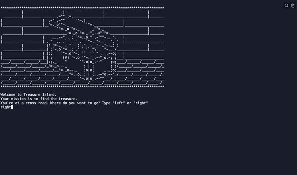

# Day 3 Control Flow and Logical Operators
## Functions/Concepts 
* **Modulo Operator (%)**: shows the remainder after a division
  ```
  5%2
  #result is 1
  ```
### Conditionals 
* **if/else statement**
  ```
  age = 18
  if age > 16:
     print("Can drive")
  else:
     print("Don't drive")
  ```
* **Nested if statements:** You can have if statements inside if statements
  ```
  x= 41
  if x > 10:
    print("Above ten,")
    if x > 20:
      print("and also above 20!")
    else:
      print("but not above 20.")
  ```
* **if/elif/else statements:** you can add extra conditions to test if the first condition is false.
Once an elif condition is true, the rest of the elif conditions are no longer checked and are skipped.
  ```
  a = 200
  b = 33
  if b > a:
    print("b is greater than a")
  elif a == b:
    print("a and b are equal")
  else:
    print("a is greater than b")
  ```
* **Indentation:** Python relies on indentation (whitespace at the beginning of a line) to define the scope in the code

### Comparison Operators 
| Operator       | Condition           
| ------------- |:-------------| 
| >      | greater than | 
| >=      | greater than or equal to      |   
| < | less than      |     
| <= | less than or equal to     |  
| ==      | is equal to | 
| !=      | is not equal to   | 


= assign this value to this variable 
<br> == check to see if the value on the left is equal to the value on the right 


## Exercises 
* https://replit.com/@wuxinge/day-3-1-exercise
* https://replit.com/@wuxinge/day-3-2-exercise
* https://replit.com/@wuxinge/day-3-3-exercise
* https://replit.com/@wuxinge/day-3-4-exercise
* https://replit.com/@wuxinge/day-3-5-exercise

## Project 


* https://replit.com/@wuxinge/day-3-project-treasure-island 

## Resources 
* [ASCII art](https://ascii.co.uk/art) : combinations of two or three characters for expressing emotion in text.
