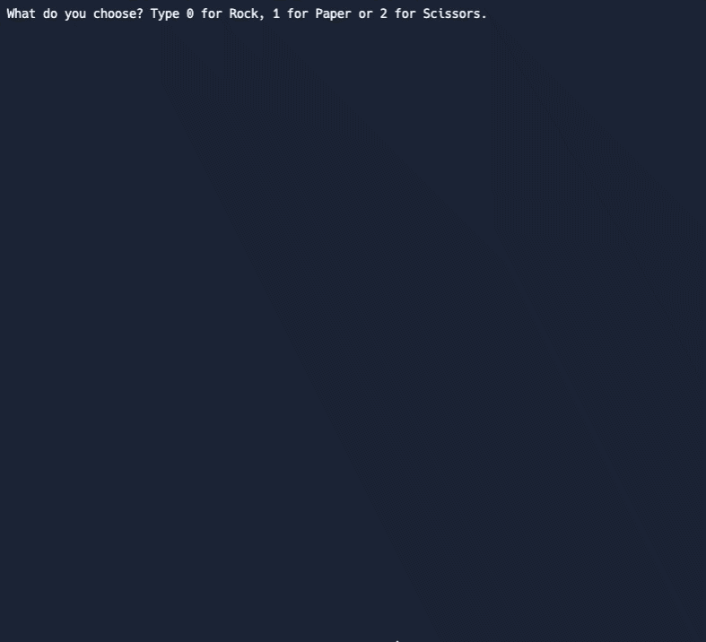

# Day 4 Randomization and Python Lists

## Learning Takeaways
### Function/Concepts

#### Randomization 
The random functions come from the random module which needs to be imported.
  ```
  import random
  n = random.randint(3, 10)
  ```
* **Random Module**: is used to generate pseudo-random numbers
* **randint(start, end)**: Return a number between 3 and 9 (both included)
* **random()**: Return a random float number between 0 and 1. 
  ```
  import random
  random.random()
  ```

#### Python Lists 
- A way of organizing and storing data in Python. (AKA data structure) 
  ```
  list_name = [item1, item2, item3]
  ```
* **.append()**: add a single item to a list
  ```
  all_fruits = ["apple", "banana", "orange"]
  all_fruits.append("pear")
  #all_fruits = ["apple", "banana", "orange", "pear"]
  ```
* **Add list together**: you can extend a list with another list by ```+```
  ```
  list1 = [1, 2, 3]
  list2 = [9, 8, 7]
  new_list = list1 + list2
  list1 += list2
  ```
* **alter the value in a list**
  ```
  all_fruits = ["apple", "banana", "orange"]
  all_fruits[0] = "cherry"
  #all_fruits = ["cherry", "banana", "orange"]
  ```
* **.split(,):** splits a string into a list
  ```
  txt = "hello, my name is Peter, I am 26 years old"
  x = txt.split(", ")
  print(x)
  #['hello', 'my name is Peter', 'I am 26 years old']
  ```
* **list():** creates a list object.
  ```
  areas = [11.25, 18.0, 20.0, 10.75, 9.50]

  #Create areas_copy
  areas_copy = areas
  areas_copy = list(areas) #explict copy of the list areas or you can use [:]

   #Change areas_copy
  areas_copy[0] = 5.0

  #Print areas
  print(areas)
  ``` 

#### List index
- use the index number to get hold of a particular item from the list
- index number can be negative if you want to start counting from the end of the list
  ```
  letters = ["a", "b", "c"]
  letters[0]
  #Result: "a"
  letters[-1]
  #Result: "c"
  ``` 
  
#### Nested lists 
A list within a list. 
  ```
  row1 = [1, 2]
  row2 = [3, 4]
  square = [row1, row2]
```

## Exercises 
* https://replit.com/@wuxinge/day-4-1-exercise
* https://replit.com/@wuxinge/day-4-2-exercise
* https://replit.com/@wuxinge/day-4-3-exercise
  
## Project

* https://replit.com/@wuxinge/day-4-project-rock-paper-scissors
  
## Resources 
* [Random Module](https://www.askpython.com/python-modules/python-random-module-generate-random-numbers-sequences)
* [Data Structures](https://docs.python.org/3/tutorial/datastructures.html)
