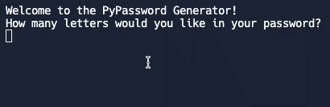

# Day 5 Python Loops
## Learning Takeaways 
### Functions/Concepts 
* **For loop:** used for iterating over a sequence (that is either a list, a tuple, a dictionary, a set, or a string).
```
all_fruits = ["apple", "banana", "orange"]

for fruit in all_fruits:
   print(fruit)
 #result: apple 
          banana 
          orange
```
For loop will run for as many times as there are items inside the list. 

* **range(start, stop, step):** returns a sequence of numbers, starting from 0 by default, and increments by 1 (by default), and stops before a specified number.
    start - included
    stop - not included
    step - incrementation
```
x = range(3, 10, 2)
for n in x:
  print(n)
#result: 3
         5
         7
         9
``` 
## Exercise 
* https://replit.com/@wuxinge/day-5-1-exercise
* https://replit.com/@wuxinge/day-5-2-exercise
* https://replit.com/@wuxinge/day-5-3-exercise
* https://replit.com/@wuxinge/day-5-4-exercise

## Project 
 
* https://replit.com/@wuxinge/day-5-project-password-generator
