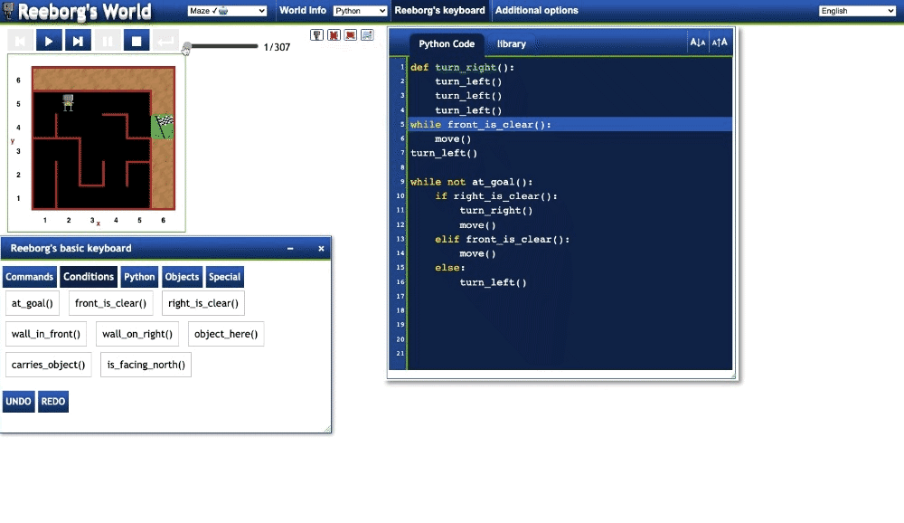

# Day 6 Python Functions and Karel

## Learning Takeaways 
### Functions/Concepts 
* **Defining functions:** to specify what should do 
```
def my_function():
    #Do this
    #Then do this
    #Finally do this
```
* **Calling functions:** to execute the function
```
my_function()
```

* **While loop:** this is a loop that will keep repeating itself until the while condition becomes false.
```
while something_is_true:
    #Do this
    #Then do this
    #Finally do this
```
#### While loop vs For loop 
|while loop        |for loop        | 
| :------------- |:-------------| 
|carry out functionally many times until sort of condition is met     | when you want to iterate over something and you need to do something with each thing that you are iterating over | 

 


## Exercises 
* [Hurdle 1](https://reeborg.ca/reeborg.html?lang=en&mode=python&menu=worlds%2Fmenus%2Freeborg_intro_en.json&name=Hurdle%201&url=worlds%2Ftutorial_en%2Fhurdle1.json)

* [Hurdle 2](https://reeborg.ca/reeborg.html?lang=en&mode=python&menu=worlds%2Fmenus%2Freeborg_intro_en.json&name=Hurdle%202&url=worlds%2Ftutorial_en%2Fhurdle2.json)

* [Hurdle 3](https://reeborg.ca/reeborg.html?lang=en&mode=python&menu=worlds%2Fmenus%2Freeborg_intro_en.json&name=Hurdle%203&url=worlds%2Ftutorial_en%2Fhurdle3.json)

* [Hurdle 4](https://reeborg.ca/reeborg.html?lang=en&mode=python&menu=worlds%2Fmenus%2Freeborg_intro_en.json&name=Hurdle%204&url=worlds%2Ftutorial_en%2Fhurdle4.json)

## Projects 

```
def turn_right():
    turn_left()
    turn_left()
    turn_left()
while front_is_clear():
    move()
turn_left()

while not at_goal():
    if right_is_clear():
        turn_right()
        move()
    elif front_is_clear():
        move()
    else:
        turn_left()
```
* https://reeborg.ca/reeborg.html?lang=en&mode=python&menu=worlds%2Fmenus%2Freeborg_intro_en.json&name=Maze&url=worlds%2Ftutorial_en%2Fmaze1.json

