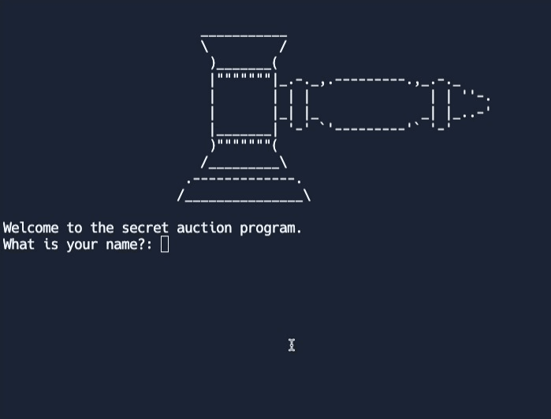
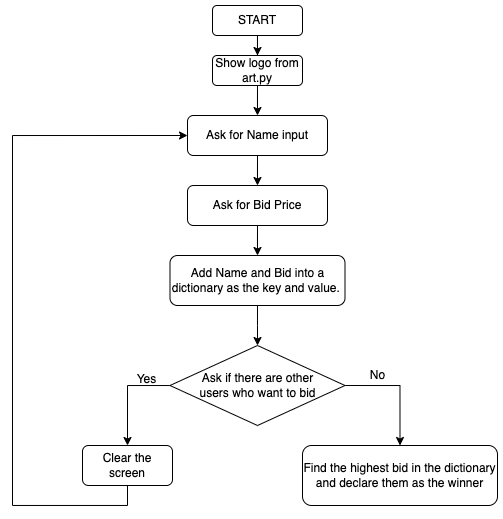

# Day 9 Dictionaries, Nesting and the Secret Auction

## Learning Takeaways/Concepts 
1. **Dictionary**
   ```
   dictionary = {"key": "value"}
   ```
     1) Retrieving items from dictionary
        ```
        print(dictionary["key"]
        #result: "value"
        ```
     2) Adding new items to dictionary
        ```
        dictionarty["key2"] = "value2"
        #result: dictionary = {"key": "value", "key2":"value2"}
        ```
     3) Wiping an existing dictionary
        ```
        dictionary={}
        print(dictionary)
        #result: {}
        ```
     4) Editing an item in a dictionary
        ```
        dictionary["key2"]="value22"
        #result: dictionary = {"key": "value", "key2":"value22"}
        ```
     5) Looping through a dictionary
        ```
        for key in dictionary:
          print(key) #key of the dictionary 
          print(dicitonary[key]) #value of the dictionary
        ```
2. **Nesting**
    1) Nesting a list in a dictionary
       ```
       travel_log = {
         "France": ["Paris", "Lille", "Dijon"],
         "Germany": ["Berlin", "Hamburg", "Stuttgart"]
         }
       ```
    2) Nesting a dictionary in a dictionary
       ```
       travel_log = {
         "France"={"city_visited": ["Paris", "Lille", "Dijon"], "total_visits":12},
         "Germany"={"city_visited": ["Berlin", "Hamburg", "Stuttgart"],"total_visits":5}
         }
       ```  
    3) Nesting a dictionary in a list
       ```
        travel_log = [
         {"country": "France",
           "city_visited": ["Paris", "Lille", "Dijon"],
           "total_visits":12},
         {"country": "Germany",
           "city_visited": ["Berlin", "Hamburg", "Stuttgart"],
           "total_visits":5}
         ]
        ```
## Exercises 
*  https://replit.com/@wuxinge/day-9-1-exercise
*  https://replit.com/@wuxinge/day-9-exercise-2
  
## Project: The Secret Auction 
 

Flowchart 
 

* Final version: https://replit.com/@wuxinge/day-9-project-blind-auction
* Alternative solution: https://replit.com/@wuxinge/day-9-project-blind-auction-solution
